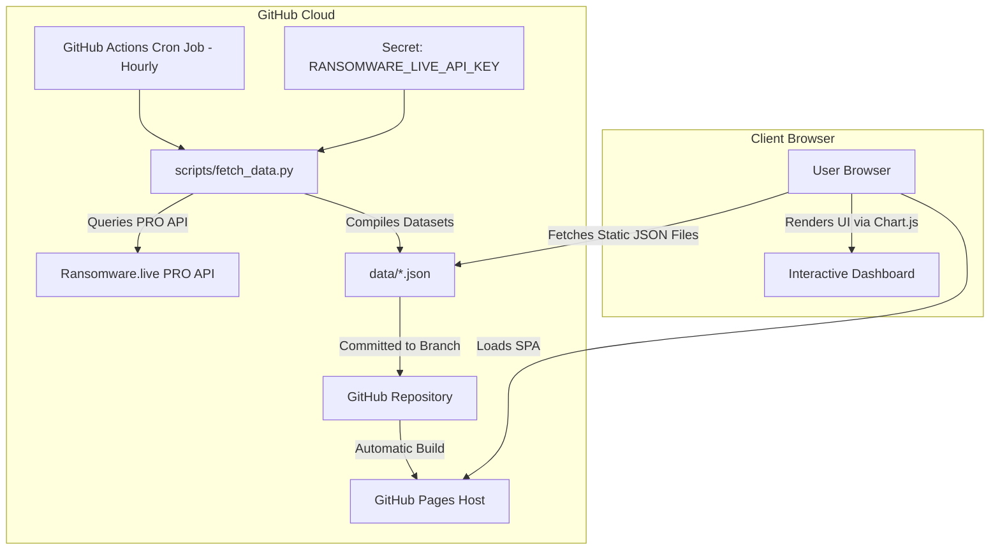

# Stealer.Live: Infostealer & Ransomware Correlation Dashboard

Stealer.Live is a premium, high-performance threat intelligence dashboard designed to correlate ransomware victims with prior infostealer credential compromise records. Using data from the **Ransomware.live PRO API** (partnered with **Hudson Rock**), the dashboard provides threat analysts with corporate threat footprint visibility before and during ransomware deployment.

Developed as a modern, single-page application (SPA), it utilizes rich dark-mode aesthetics, glassmorphic UI components, dynamic micro-animations, and interactive visualizations.

---

## 🚀 Key Features

* **Threat Dashboard**: High-level KPIs and trends, including total compromised employee credentials, exposed customer log records, Monthly Ingestion trends, Top Stealer Families, and affected sectors/countries.
* **Victims Feed**: Interactive data grid displaying correlated victim profiles. Supports instant keyword search and multi-criteria filtering (by ransomware group, sector, country, and stealer presence).
* **SEC Form 8-K Disclosures Feed**: A real-time feed tracking corporate cybersecurity incident filings (Item 1.05 and 8.01) submitted to the SEC EDGAR system, mapped to threat group attributions.
* **Group Intel Profiles**: Interactive progress bars ranking threat groups based on the percentage of their victims who had pre-existing credential exposures. Slide-out detail drawers display group TTPs, onion leaksites, and CVE associations.
* **Interactive Side-Drawer**: Provides deep-dive views for specific victims or groups without navigating away from the current view.

---

## 🏗️ Architecture & Security Design

To prevent exposing the private **Ransomware.live PRO API Key** to the public internet, the application operates on a **Static Site Generation (SSG) caching pipeline**:



### Advantages of this Architecture
1. **Zero Key Exposure**: The API key is stored securely as a GitHub Repository Secret and is only accessed inside the transient GitHub Action container.
2. **Infinite Scaling & Speed**: The client-side dashboard queries static JSON files directly from GitHub Pages' high-speed CDN, resulting in near-instant load times and zero server overhead.
3. **API Quota Protection**: Instead of fetching from the API on every page load (which could easily exhaust the 500,000 monthly request quota), the cron job polls only 24 times a day, utilizing less than **1.5%** of the quota.

---

## 📂 Project Structure

```
├── .github/workflows/
│   └── update_data.yml     # Hourly GitHub Actions fetch and commit pipeline
├── css/
│   └── styles.css          # Core design system (glassmorphism, typography, responsive grids)
├── data/
│   ├── summary.json        # Compiled statistical aggregations
│   ├── victims.json        # Unified victim-leak correlation index
│   ├── groups.json         # Ransomware group profiles & TTP cache
│   └── sec8k.json          # SEC 8-K disclosures feed cache
├── js/
│   └── app.js              # SPA navigation, state manager, Chart.js integrations
├── scripts/
│   ├── fetch_data.py       # Live API retrieval & parsing script (Python)
│   └── generate_mock.py    # Offline mock-data generator for dev testing
├── .env.example            # Environment variables template
├── index.html              # Main dashboard entrypoint
├── package.json            # Node/Vite development scripts
└── README.md               # Documentation
```

---

## 💻 Local Development

### Prerequisites
* Python 3.x (to run backend scripts and local server)
* *Optional*: Node.js (if you wish to use Vite for hot reloading)

### Step 1: Clone the Repository
```bash
git clone https://github.com/<your-username>/infostealer-tracker.git
cd infostealer-tracker
```

### Step 2: Set Up Environment Variables (For API Crawling)
Copy `.env.example` to `.env` and fill in your Ransomware.live PRO API key:
```bash
cp .env.example .env
```
Open `.env` in a text editor:
```env
RANSOMWARE_LIVE_API_KEY=your_real_api_key_here
```

### Step 3: Populate Mock Data (Recommended for Offline Development)
If you don't have an active API Key or want to run offline, generate high-fidelity mock data:
```bash
python3 scripts/generate_mock.py
```
This will populate the `data/` folder with simulated 2025/2026 data.

### Step 4: Run a Local Server

#### Option A: Using Python (Simplest, no dependencies)
Start Python's built-in web server:
```bash
python3 -m http.server 8000
```
Open your browser and navigate to `http://localhost:8000`.

#### Option B: Using Node & Vite (With hot-reloading)
Install dependencies and launch the dev server:
```bash
npm install
npm run dev
```
Open the local server URL printed in your terminal (usually `http://localhost:5173`).

---

## 🚀 Deploying to GitHub Pages

1. **Create a GitHub Repository**: Create a new public or private repository on GitHub.
2. **Push Code to GitHub**:
   ```bash
   git init
   git add .
   git commit -m "Initial commit: Stealer.Live Dashboard"
   git branch -M main
   git remote add origin https://github.com/<username>/<repo-name>.git
   git push -u origin main
   ```
3. **Configure the API Key Secret**:
   * Navigate to your GitHub repository.
   * Go to **Settings** > **Secrets and variables** > **Actions**.
   * Click **New repository secret**.
   * Name: `RANSOMWARE_LIVE_API_KEY`.
   * Value: Paste your Ransomware.live PRO API Key.
4. **Configure Permissions for the Action**:
   * In **Settings** > **Actions** > **General**, scroll down to **Workflow permissions**.
   * Select **Read and write permissions** (this allows the bot to commit updated JSON feeds back to `main`).
   * Save changes.
5. **Enable GitHub Pages**:
   * Go to **Settings** > **Pages**.
   * Under **Build and deployment** > **Source**, select **Deploy from a branch**.
   * Select the `main` branch and the `/ (root)` folder, then click **Save**.
6. **Trigger the First Run**:
   * Go to the **Actions** tab, select **Update Threat Intel Data**, and click **Run workflow** to pull live data immediately.

---

## 🛡️ License

This project is licensed under the MIT License. Data parsed is subject to Ransomware.live terms.
